---
## Front matter
lang: ru-RU
title: Компьютерный практикум по статистическому анализу данных презентация к лабораторной работе №1 
subtitle: Julia. Установка и настройка. Основные принципы
author:
  - Ким И. В. НФИбд-01-21
institute:
  - Российский университет дружбы народов, Москва, Россия

## i18n babel
babel-lang: russian
babel-otherlangs: english

## Formatting pdf
toc: false
toc-title: Содержание
slide_level: 2
aspectratio: 169
section-titles: true
theme: metropolis
header-includes:
 - \metroset{progressbar=frametitle,sectionpage=progressbar,numbering=fraction}
---

# Цель работы

Основная цель работы — подготовить рабочее пространство и инструментарий для
работы с языком программирования Julia, на простейших примерах познакомиться
с основами синтаксиса Julia.

# Задание 

1. Установите под свою операционную систему Julia, Jupyter (разделы 1.3.1 и 1.3.2).

2. Используя Jupyter Lab, повторите примеры из раздела 1.3.3.

3. Выполните задания для самостоятельной работы (раздел 1.3.4).

# Задание для самостоятельной работы

1. Изучите документацию по основным функциям Julia для чтения / записи / вывода информации на экран: read(), readline(), readlines(), readdlm(), print(),
println(), show(), write(). Приведите свои примеры их использования, поясняя особенности их применения.

2. Изучите документацию по функции parse(). Приведите свои примеры её использования, поясняя особенности её применения.

3. Изучите синтаксис Julia для базовых математических операций с разным типом переменных: сложение, вычитание, умножение, деление, возведение в степень, извлечение
корня, сравнение, логические операции. Приведите свои примеры с пояснениями по
особенностям их применения.

4. Приведите несколько своих примеров с пояснениями с операциями над матрицами
и векторами: сложение, вычитание, скалярное произведение, транспонирование,
умножение на скаляр.

# Выполнение лабораторной работы

## Установил Julia и Jupyter 

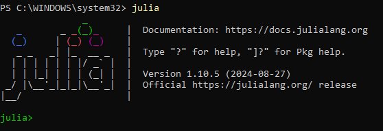{#fig:001 width=60%}

## Повторил примеры из раздела 1.3.3. 

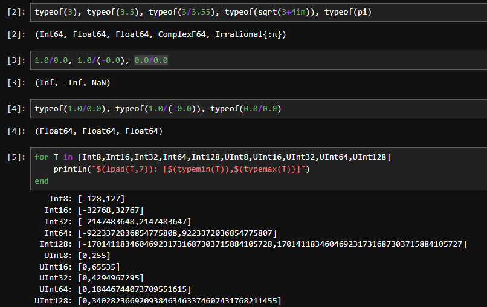{#fig:002 width=60%}

## Повторил примеры из раздела 1.3.3. 

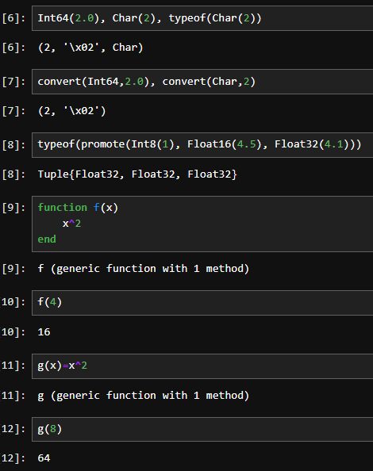{#fig:003 width=60%}

## Повторил примеры из раздела 1.3.3. 

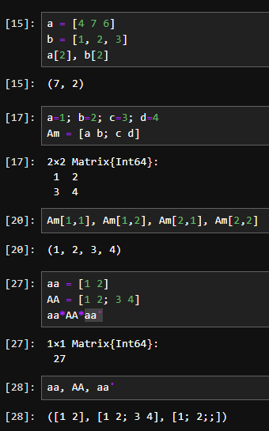{#fig:004 width=60%}

# Задания для самостоятельной работы

# Задание №1

## Прикрепил к проекту txt файл "try.txt" и прочитал его с помощью функции read() 

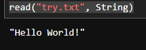{#fig:005 width=60%}

## Функция readline()читает первую строку 

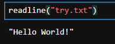{#fig:006 width=60%}

## Функция readlines() считывает все строки из текстового файла 

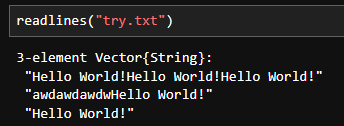{#fig:007 width=60%}

## Функция print() выводит текст без перехода на новую строку 

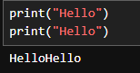{#fig:008 width=60%}

## Функция println() выводит текст с переходом на новую строку 

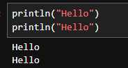{#fig:009 width=60%}

##  Функция show() выводит все, что находится в скобках как оно есть 

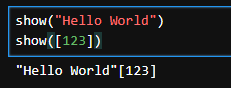{#fig:010 width=60%}

##  С помощью функции write() можно записать текст в открытый файл(нужно указать режим открытия) 

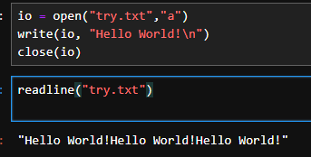{#fig:011 width=60%}

# Задание №2

## Функция parse() позволяет преобразовать(распарсить) строку в числа или выражение 

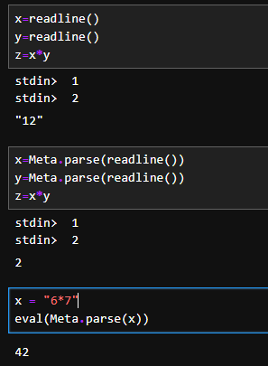{#fig:012 width=60%}

# Задание №3

## Базовые математические операции

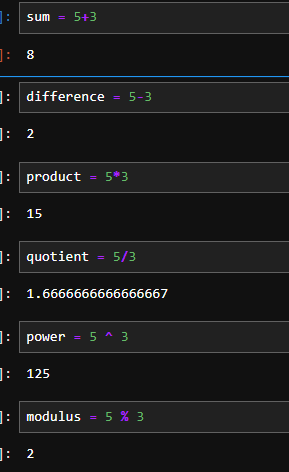{#fig:013 width=60%}

## Базовые математические операции

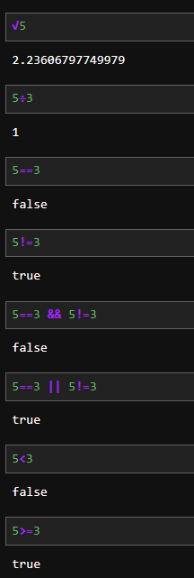{#fig:014 width=60%}

# Задание №4

## Операции над матрицами

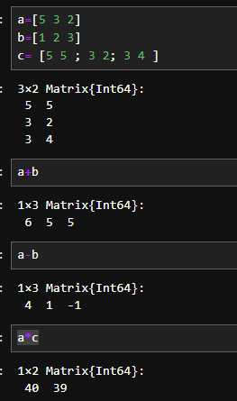{#fig:015 width=60%}

## Операции над матрицами

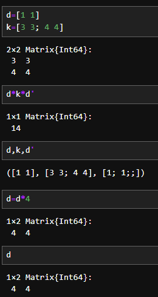{#fig:016 width=60% }

# Выводы

Подготовил рабочее пространство и иструментарий для работы с языком программирования Julia, на простейших примерах познакомился с основами синтаксиса Julia. Выполнил задания для самостоятельной работы.

