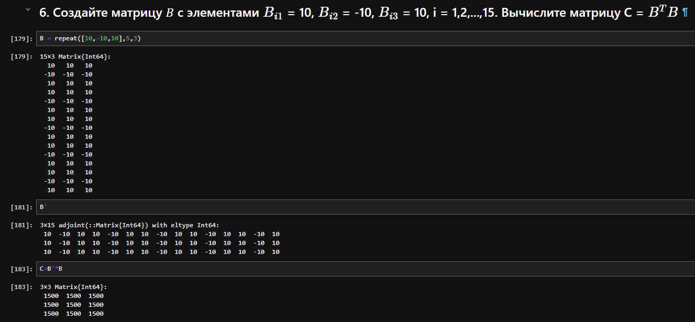

---
## Front matter
lang: ru-RU
title: Компьютерный практикум по статистическому анализу данных презентация к лабораторной работе №3 
subtitle: Управляющие структуры
author:
  - Ким И. В. НФИбд-01-21
institute:
  - Российский университет дружбы народов, Москва, Россия

## i18n babel
babel-lang: russian
babel-otherlangs: english

## Formatting pdf
toc: false
toc-title: Содержание
slide_level: 2
aspectratio: 169
section-titles: true
theme: metropolis
header-includes:
 - \metroset{progressbar=frametitle,sectionpage=progressbar,numbering=fraction}
---

# Цель работы

Основная цель работы — освоить применение циклов функций и сторонних для Julia
пакетов для решения задач линейной алгебры и работы с матрицами.

# Задание

- Используя Jupyter Lab, повторите примеры из раздела 3.2

- Выполните задания для самостоятельной работы (раздел 3.4)

# Выполнение работы. Повтор примеров из раздела 3.2

# 3.2.1. Циклы While и for

## Цикл, который пока n<10 прибавляет к n единицу и печатает значение 

{#fig:001 width=70% height=70%}

## Задали массив со строковыми элементами. Далее в цикле подставляется имя из массива в заданную строку и выводит на экран.

{#fig:002 width=70% height=70%}

## Использование цикла for для создание двумерного массива, в котором значение каждой записи является суммой индексов строки и столбца

{#fig:003 width=70% height=70%}

# 3.2.2. Условные выражения

## Пример, в котором используется условие: если N делится на 3 выводится "Fizz", если на 5 "Buzz", если на 3 и на 5 "FizzBuzz"

{#fig:004 width=70% height=70%}

# 3.2.3. Функции

## Написал функцию, при вызове которой подставляет принятое имя в строку. Вторая функция - функция возведения в квадрат

{#fig:005 width=70% height=70%}

## Написал функцию, при вызове которой подставляет принятое имя в строку. Вторая функция - функция возведения в квадрат

{#fig:006 width=70% height=70%}

## Задал массив v и отсортировал его функцией sort(v) и sort!(v). Разница в них была в том, что sort!(v) меняли значения в нашем массиве, а sort(v) - нет. Функция map() применила функцию f ко всем элементам массива

{#fig:007 width=70% height=70%}

## Применил функцию broadcast, которая привела все объекты к общему измерению, в отличие от функции map, которая напрямую применяет функцию поэлементно. Задал матрицу A и применили к ней функцию f(A) возведения в квадрат, получил A*A. Далее применил функцию f.(A), получил матрицу, где каждый элемент возведен в квадрат.

{#fig:008 width=70% height=70%}

## Попробовал пример записей с синтаксисом broadcast.

{#fig:009 width=70% height=70%}

# 3.2.4 Сторонние библиотеки (пакеты) в Julia

## Загрузил пакеты и попробовал их использовать

{#fig:010 width=70% height=70%}

## Загрузил пакеты и попробовал их использовать

{#fig:011 width=70% height=70%}

# 3.4 Задания для самостоятельного выполнения

# Задание 1

## Использовал цикл for для печати чисел от 1 до 100 и их квадратов.

{#fig:012 width=70% height=70%}

## Объявил, что squares - это словарь. Использовал цикл for от 1 до 100, где присвоил целые числа к ключам, а их квадраты в качестве пар-значений.

{#fig:013 width=70% height=70%}

## Сделал тоже самое, использую цикл while

{#fig:014 width=70% height=70%}

## Задал массив нулей squares_arr размерностью 100, использовал цикл for для возведения i в квадрат, записи в массив и вывода на экран. Сделал тоже самое, используя цикл while.

{#fig:015 width=70% height=70%}

# Задание 2

## Использовал цикл for от 1 до 10 с условием: если остаток от деления i на 2 равен нулю, то выводит на экран, что число i чётное, в ообратном случае - нечётное

{#fig:016 width=70% height=70%}

# Задание 3

## Написал функцию add_one, которая прибавляет единицу к своему входному значению.

{#fig:017 width=70% height=70%}

# Задание 4

## Задал матрицу A размерностью 3x3, использовал функцию broadcast, в которой прибавил ко всем элементам матрицы единицу. Сделал тоже самое, используюж функцию map() и add_one().

{#fig:018 width=70% height=70%}

# Задание 5

## Задал матрицу A и функцию возведения в куб f, применил функцию f(A) и получил матрицу нулей. Во втором пункте использовал цикл for от 3 до 9 с шагом 3, в котором присваивал к 3, 6 и 9 элементам сумму первого и второго. 

{#fig:019 width=70% height=70%}

# Задание 6

## Создал матрицу B используя функцию repeat, и нашел произведение транспнированной B на B

{#fig:020 width=70% height=70%}

# Задание 7

## Создал матрицу Z размерности 6x6, где все элементы равны нулю и матрицу E, где все элементы равны 1

{#fig:021 width=70% height=70%}

## Задал 4 матрицы заполненные нулями размерностью 6x6, далее нашел закономерности, по которым их нужно привести к нужным матрицам, и использую цикл for и условие if выполнил задание.

## Матрица Z1 и Z2

{#fig:022 width=70% height=70%}

## Матрица Z3

{#fig:023 width=70% height=70%}

## Матрица Z4

{#fig:024 width=70% height=70%}

# Задание 10

## Использую функцию rand, создал матрицу M размерности 6x10, элементами которой являются целые числа, выбранные случайным образом из диапозона 1,2,...10.  Используя цикл for перебрал всю матрицу и нашел количество элементов, которые больше 4

{#fig:25 width=70% height=70%}

## Задал P=7, использовал цикл for от 1 до размерности матрицу по строкам (6), ввел счетчик z, который будет обнуляться при движении i, ввел второй цикл j от 1 до размерности матрицы по столбцам (10), ввел условие, что если элемент матрицы равен P, то срабатывает счетчик. После того, как мы прошли один круг цикла j проверяется условие, что если z==2, то напечатать строку. И так проверяется каждая строка.

{#fig:26 width=70% height=70%}

## Использовал цикл for для нахождения суммы элементов каждого столбца, далее присваиваю это значение к новому массиву A и веду счетчик для порядка элементов в массиве A. После использую еще один цикл, в котором перебираю элементы массива A и ищу пары стобцов, сумма элементов которых будет больше 75, если она больше, то печатает на экран.

{#fig:27 width=70% height=70%}

# Задание 11

{#fig:28 width=70% height=70%}

# Выводы

Использую Jupyter lab повторил примеры из раздела 3.2 и выполнил задания для самостоятельной работы.

