---
## Front matter
lang: ru-RU
title: Компьютерный практикум по статистическому анализу данных презентация к лабораторной работе №4 
subtitle: Линейная алгебра
author:
  - Ким И. В. НФИбд-01-21
institute:
  - Российский университет дружбы народов, Москва, Россия

## i18n babel
babel-lang: russian
babel-otherlangs: english

## Formatting pdf
toc: false
toc-title: Содержание
slide_level: 2
aspectratio: 169
section-titles: true
theme: metropolis
header-includes:
 - \metroset{progressbar=frametitle,sectionpage=progressbar,numbering=fraction}
---

# Цель работы

Основной целью работы является изучение возможностей специализированных пакетов Julia для выполнения и оценки эффективности операций над объектами линейной
алгебры.

# Задание

- Используя Jupyter Lab, повторите примеры из раздела 4.2.

- Выполните задания для самостоятельной работы (раздел 4.4).

# Выполнение работы. Повтор примеров из раздела 4.2

## 4.2.1. Поэлементные операции над многомерными массивами

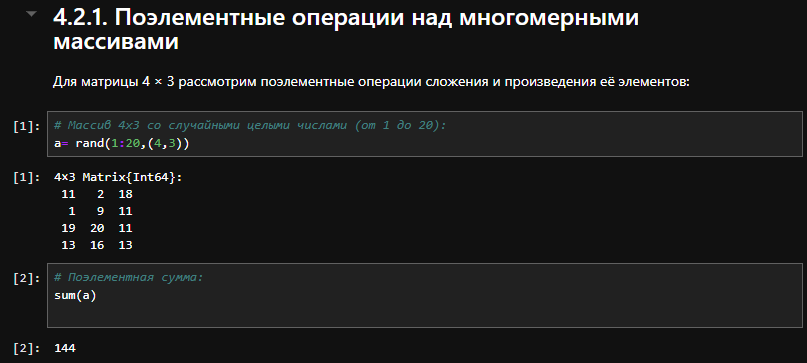{#fig:001 width=70%}

## 4.2.1. Поэлементные операции над многомерными массивами

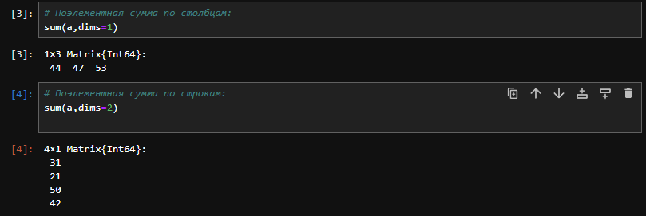{#fig:002 width=70%}

## 4.2.1. Поэлементные операции над многомерными массивами

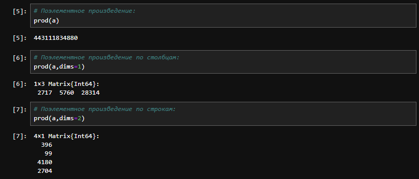{#fig:003 width=70%}

## 4.2.1. Поэлементные операции над многомерными массивами

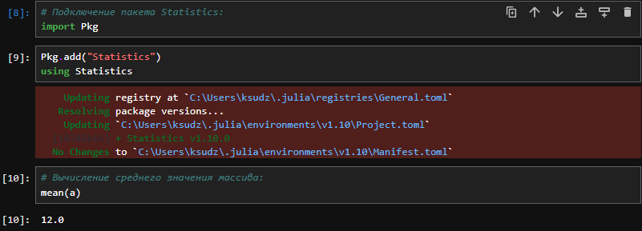{#fig:004 width=70%}

## 4.2.1. Поэлементные операции над многомерными массивами

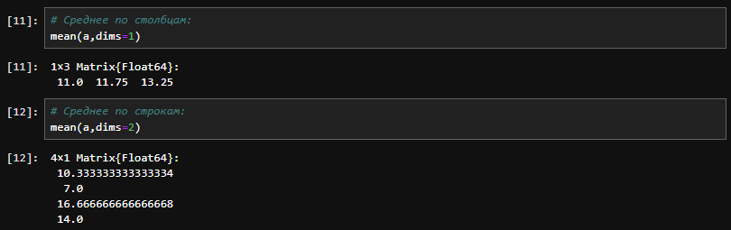{#fig:005 width=70%}

## 4.2.2. Транспонирование, след, ранг, определитель и инверсия матрицы

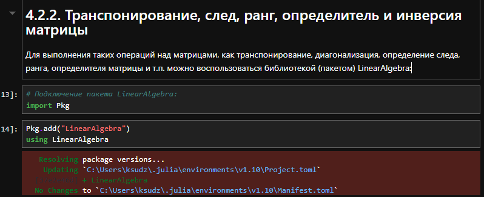{#fig:006 width=70%}

## 4.2.2. Транспонирование, след, ранг, определитель и инверсия матрицы

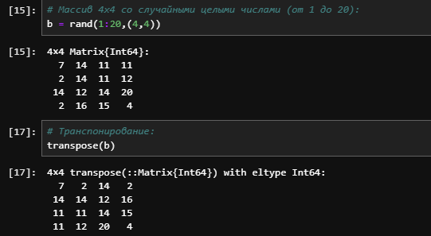{#fig:007 width=70%}

## 4.2.2. Транспонирование, след, ранг, определитель и инверсия матрицы

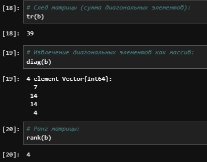{#fig:008 width=70%}

## 4.2.2. Транспонирование, след, ранг, определитель и инверсия матрицы

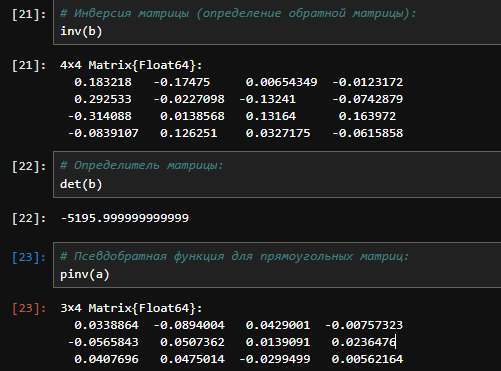{#fig:009 width=70%}

## 4.2.3. Вычисление нормы векторов и матриц, повороты, вращения

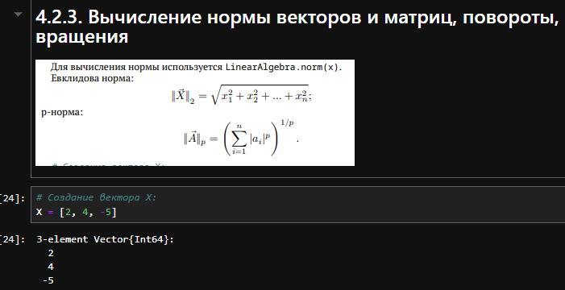{#fig:010 width=70%}

## 4.2.3. Вычисление нормы векторов и матриц, повороты, вращения

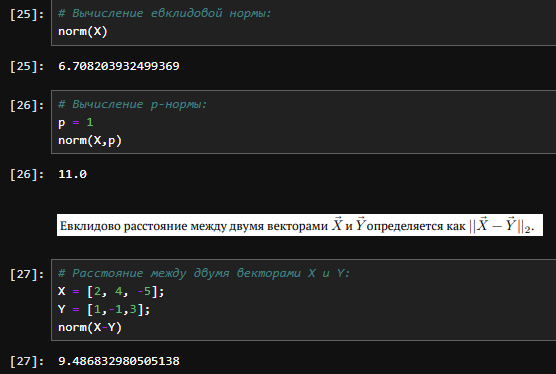{#fig:011 width=70%}

## 4.2.3. Вычисление нормы векторов и матриц, повороты, вращения

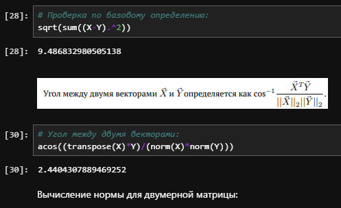{#fig:012 width=70%}

## 4.2.3. Вычисление нормы векторов и матриц, повороты, вращения

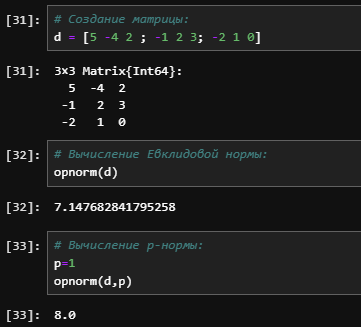{#fig:013 width=70%}

## 4.2.3. Вычисление нормы векторов и матриц, повороты, вращения

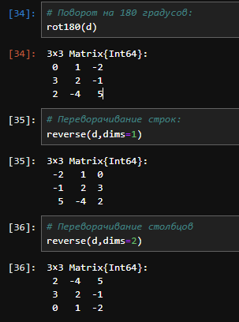{#fig:014 width=70%}

## 4.2.4. Матричное умножение, единичная матрица, скалярное произведение

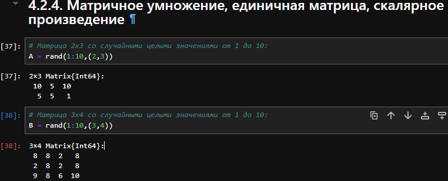{#fig:015 width=70%}

## 4.2.4. Матричное умножение, единичная матрица, скалярное произведение

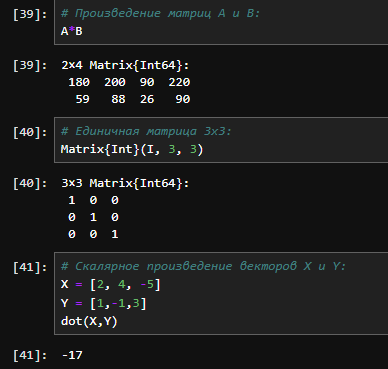{#fig:016 width=70%}

## 4.2.4. Матричное умножение, единичная матрица, скалярное произведение

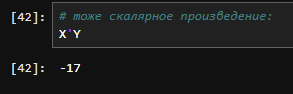{#fig:017 width=70%}

## 4.2.5. Факторизация. Специальные матричные структуры

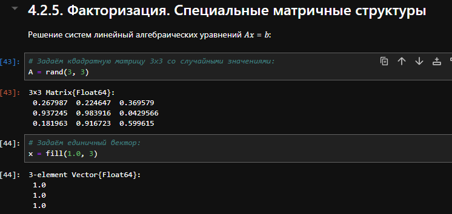{#fig:018 width=70%}

## 4.2.5. Факторизация. Специальные матричные структуры

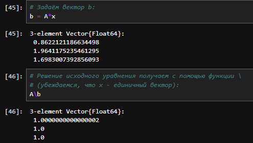{#fig:019 width=70%}

## 4.2.5. Факторизация. Специальные матричные структуры

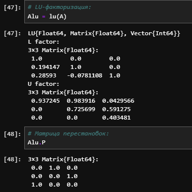{#fig:020 width=70%}

## 4.2.5. Факторизация. Специальные матричные структуры

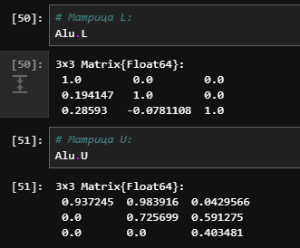{#fig:021 width=70%}

## 4.2.5. Факторизация. Специальные матричные структуры

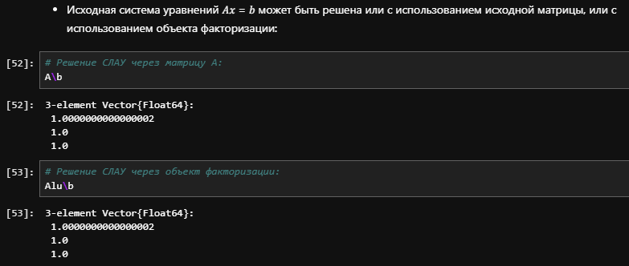{#fig:022 width=70%}

## 4.2.5. Факторизация. Специальные матричные структуры

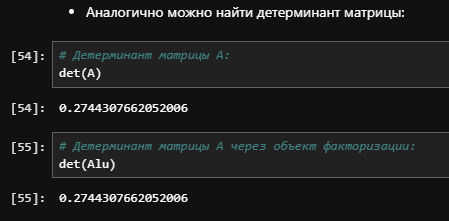{#fig:023 width=70%}

## 4.2.5. Факторизация. Специальные матричные структуры

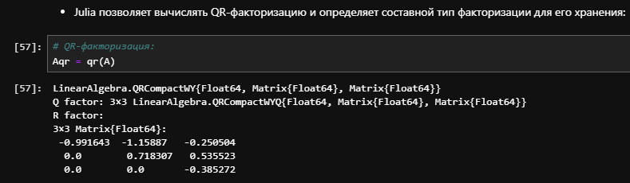{#fig:024 width=70%}

## 4.2.5. Факторизация. Специальные матричные структуры

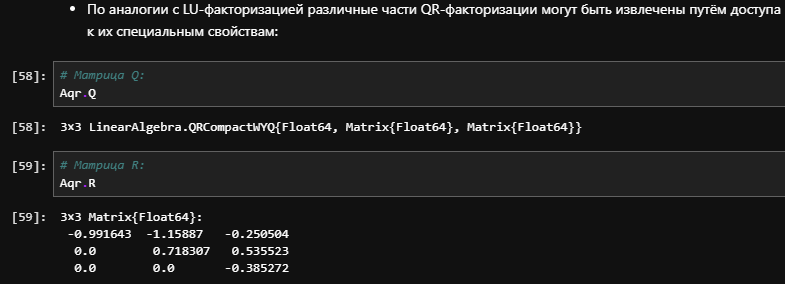{#fig:25 width=70%}

## 4.2.5. Факторизация. Специальные матричные структуры

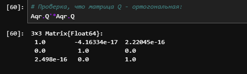{#fig:26 width=70%}

## 4.2.5. Факторизация. Специальные матричные структуры

{#fig:27 width=70%}

## 4.2.5. Факторизация. Специальные матричные структуры

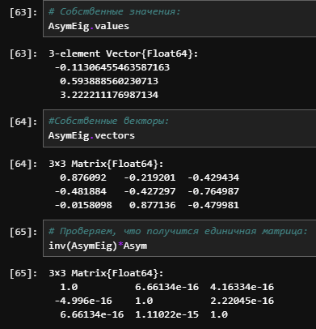{#fig:28 width=70%}

## 4.2.5. Факторизация. Специальные матричные структуры

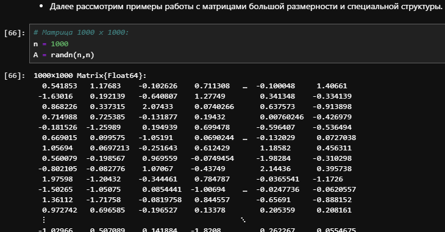{#fig:29 width=70%}

## 4.2.5. Факторизация. Специальные матричные структуры

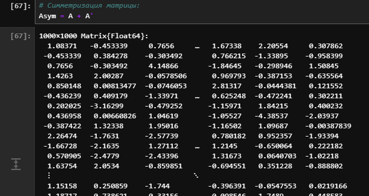{#fig:30 width=70%}

## 4.2.5. Факторизация. Специальные матричные структуры

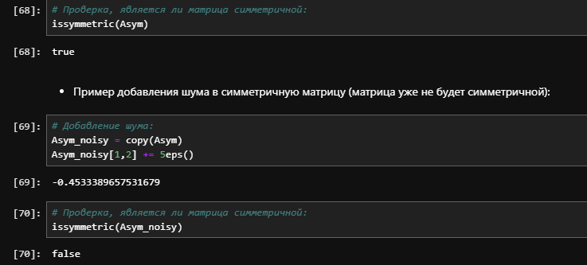{#fig:31 width=70%}

## 4.2.5. Факторизация. Специальные матричные структуры

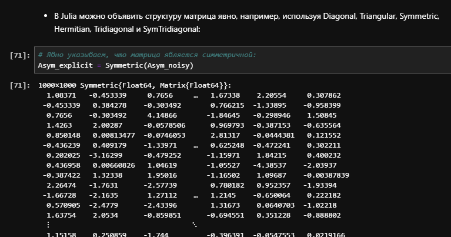{#fig:32 width=70%}

## 4.2.5. Факторизация. Специальные матричные структуры

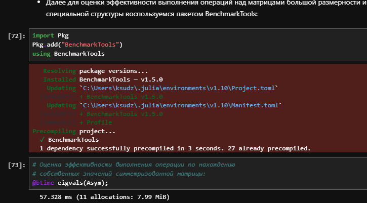{#fig:33 width=70%}

## 4.2.5. Факторизация. Специальные матричные структуры

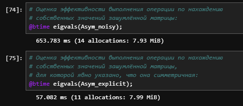{#fig:34 width=70%}

## 4.2.5. Факторизация. Специальные матричные структуры

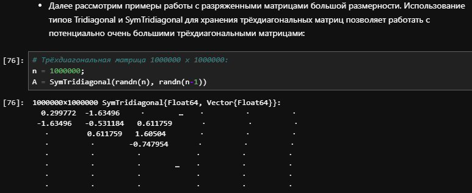{#fig:35 width=70%}

## 4.2.5. Факторизация. Специальные матричные структуры

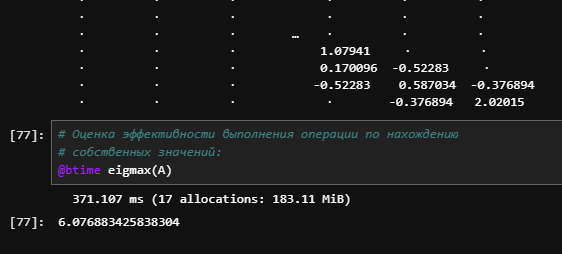{#fig:36 width=70%}

## 4.2.6. Общая линейная алгебра

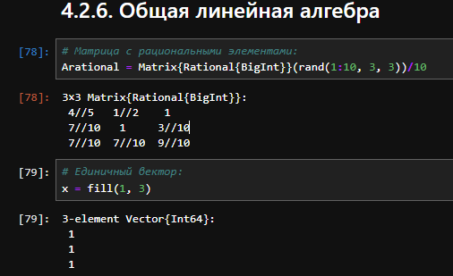{#fig:37 width=70%}

## 4.2.6. Общая линейная алгебра

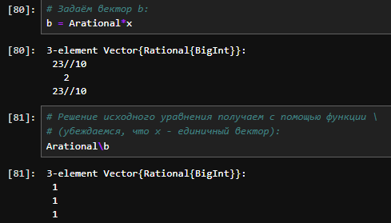{#fig:38 width=70%}

## 4.2.6. Общая линейная алгебра

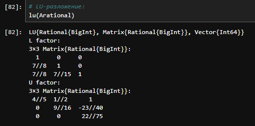{#fig:39 width=70%}

# 4.4 Задания для самостоятельного выполнения

## 4.4.1. Произведение векторов

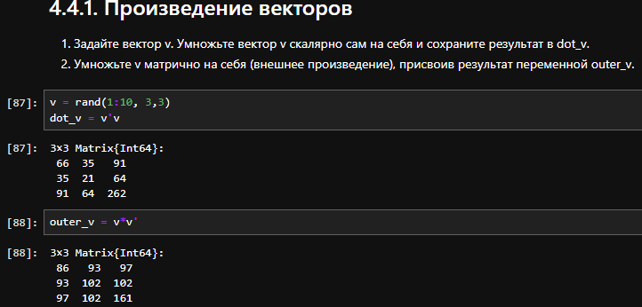{#fig:40 width=70%}

## 4.4.2. Системы линейных уравнений

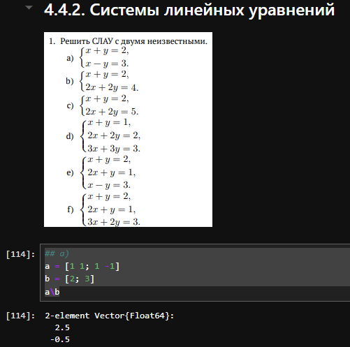{#fig:41 width=70%}

## 4.4.2. Системы линейных уравнений

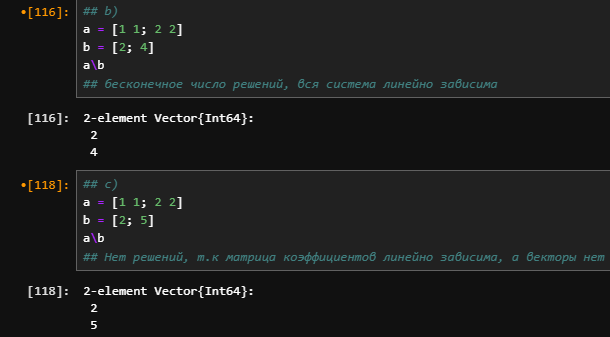{#fig:42 width=70%}

## 4.4.2. Системы линейных уравнений

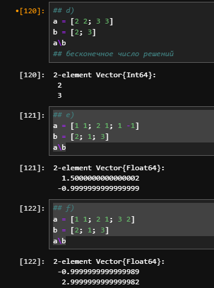{#fig:43 width=70%}

## 4.4.2. Системы линейных уравнений

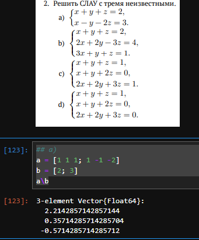{#fig:44 width=70%}

## 4.4.2. Системы линейных уравнений

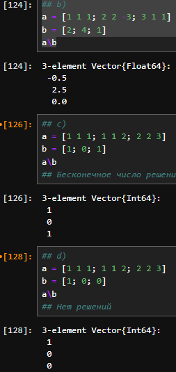{#fig:45 width=70%}

## 4.4.3. Операции с матрицами

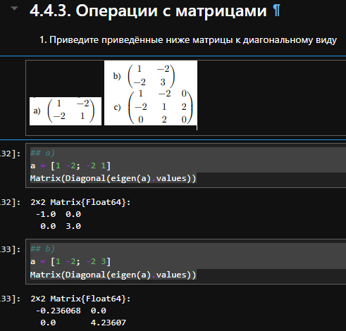{#fig:46 width=70%}

## 4.4.3. Операции с матрицами

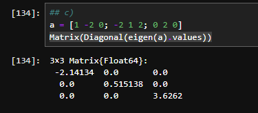{#fig:47 width=70%}

## 4.4.3. Операции с матрицами

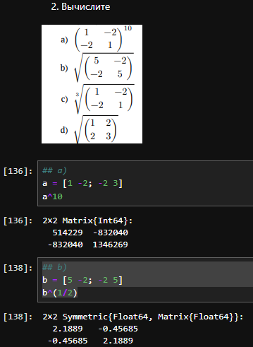{#fig:48 width=70%}

## 4.4.3. Операции с матрицами

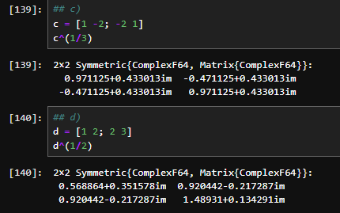{#fig:49 width=70%}

## 4.4.3. Операции с матрицами

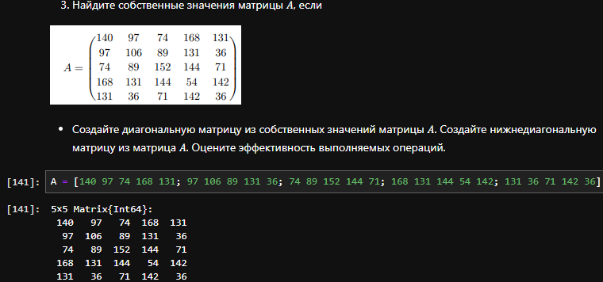{#fig:50 width=70%}

## 4.4.3. Операции с матрицами

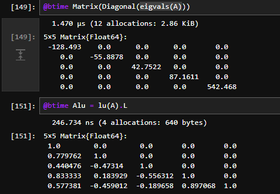{#fig:51 width=70%}

## 4.4.4. Линейные модели экономики

{#fig:52 width=70%}

## 4.4.4. Линейные модели экономики

{#fig:53 width=70%}

## 4.4.4. Линейные модели экономики

{#fig:54 width=70%}

## 4.4.4. Линейные модели экономики

{#fig:55 width=70%}

## 4.4.4. Линейные модели экономики

{#fig:56 width=70%}

## 4.4.4. Линейные модели экономики

{#fig:57 width=70%}

# Выводы

Использую Jupyter lab повторил примеры из раздела 4.2 и выполнил задания для самостоятельной работы. Изучил возможности специальных пакетов Julia для выполнения и оценки эффективности операций над объектами линейной алгебры.

