---
## Front matter
title: "Компьютерный практикум по статистическому анализу данных лабораторная работа №1"
subtitle: "Julia. Установка и настройка. Основные принципы"
author: "Ким Илья Владиславович НФИбд-01-21"

## Generic otions
lang: ru-RU
toc-title: "Содержание"

## Bibliography
bibliography: bib/cite.bib
csl: pandoc/csl/gost-r-7-0-5-2008-numeric.csl

## Pdf output format
toc: true # Table of contents
toc-depth: 2
fontsize: 12pt
linestretch: 1.5
papersize: a4
documentclass: scrreprt
## I18n polyglossia
polyglossia-lang:
  name: russian
  options:
	- spelling=modern
	- babelshorthands=true
polyglossia-otherlangs:
  name: english
## I18n babel
babel-lang: russian
babel-otherlangs: english
## Fonts
mainfont: IBM Plex Serif
romanfont: IBM Plex Serif
sansfont: IBM Plex Sans
monofont: IBM Plex Mono
mathfont: STIX Two Math
mainfontoptions: Ligatures=Common,Ligatures=TeX,Scale=0.94
romanfontoptions: Ligatures=Common,Ligatures=TeX,Scale=0.94
sansfontoptions: Ligatures=Common,Ligatures=TeX,Scale=MatchLowercase,Scale=0.94
monofontoptions: Scale=MatchLowercase,Scale=0.94,FakeStretch=0.9
mathfontoptions:
## Biblatex
biblatex: true
biblio-style: "gost-numeric"
biblatexoptions:
  - parentracker=true
  - backend=biber
  - hyperref=auto
  - language=auto
  - autolang=other*
  - citestyle=gost-numeric
## Pandoc-crossref LaTeX customization
figureTitle: "Рис."
## Misc options
indent: true
header-includes:
  - \usepackage{indentfirst}
  - \usepackage{float} # keep figures where there are in the text
  - \floatplacement{figure}{H} # keep figures where there are in the text
---

# Цель работы

Основная цель работы — подготовить рабочее пространство и инструментарий для
работы с языком программирования Julia, на простейших примерах познакомиться
с основами синтаксиса Julia.

# Задание 

1. Установите под свою операционную систему Julia, Jupyter (разделы 1.3.1 и 1.3.2).

2. Используя Jupyter Lab, повторите примеры из раздела 1.3.3.

3. Выполните задания для самостоятельной работы (раздел 1.3.4).

# Задание для самостоятельной работы

1. Изучите документацию по основным функциям Julia для чтения / записи / вывода информации на экран: read(), readline(), readlines(), readdlm(), print(),
println(), show(), write(). Приведите свои примеры их использования, поясняя особенности их применения.

2. Изучите документацию по функции parse(). Приведите свои примеры её использования, поясняя особенности её применения.

3. Изучите синтаксис Julia для базовых математических операций с разным типом переменных: сложение, вычитание, умножение, деление, возведение в степень, извлечение
корня, сравнение, логические операции. Приведите свои примеры с пояснениями по
особенностям их применения.

4. Приведите несколько своих примеров с пояснениями с операциями над матрицами
и векторами: сложение, вычитание, скалярное произведение, транспонирование,
умножение на скаляр.

# Выполнение лабораторной работы

1. Установил Julia и Jupyter (рис. [-@fig:001])

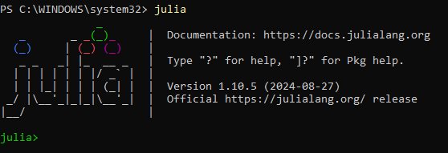{#fig:001 width=70%}

2. Повторил примеры из раздела 1.3.3. (рис. [-@fig:002])(рис. [-@fig:003])(рис. [-@fig:004])

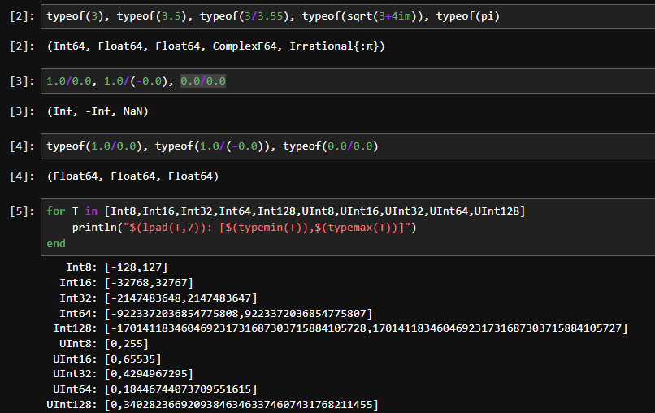{#fig:002 width=70%}

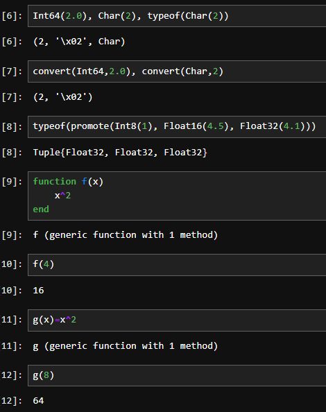{#fig:003 width=70%}

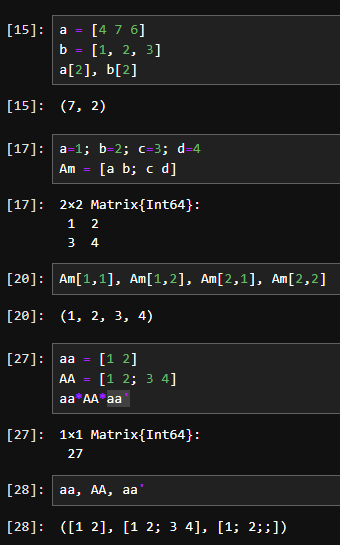{#fig:004 width=70%}

# Задания для самостоятельной работы

## Задание №1

1. Прикрепил к проекту txt файл "try.txt" и прочитал его с помощью функции read() (рис. [-@fig:005])

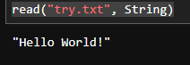{#fig:005 width=70%}

4. Функция readline()читает первую строку (рис. [-@fig:006])

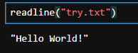{#fig:006 width=70%}

5. Функция readlines() считывает все строки из текстового файла (рис. [-@fig:007])

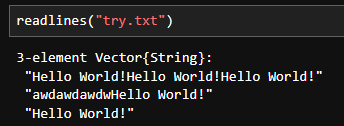{#fig:007 width=70%}

6. Функция print() выводит текст без перехода на новую строку (рис. [-@fig:008])

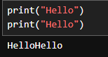{#fig:008 width=70%}

7. Функция println() выводит текст с переходом на новую строку (рис. [-@fig:009])

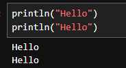{#fig:009 width=70%}

8.  Функция show() выводит все, что находится в скобках как оно есть (рис. [-@fig:010])

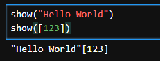{#fig:010 width=70%}

9.  С помощью функции write() можно записать текст в открытый файл(нужно указать режим открытия) (рис. [-@fig:011])

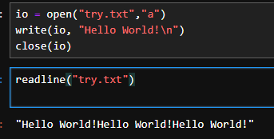{#fig:011 width=70%}

## Задание №2

1. Функция parse() позволяет преобразовать(распарсить) строку в числа или выражение  (рис. [-@fig:012])

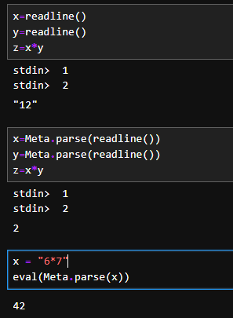{#fig:012 width=70%}

## Задание №3

1. Базовые математические операции (рис. [-@fig:013])(рис. [-@fig:014])

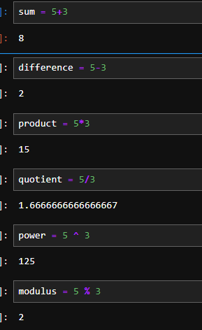{#fig:013 width=70%}

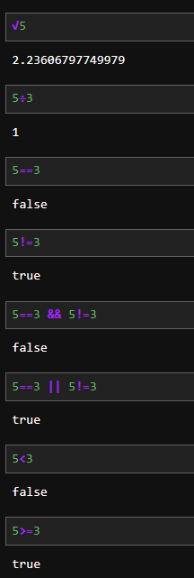{#fig:014 width=70%}

## Задание №4

1. Операции над матрицами (рис. [-@fig:015])(рис. [-@fig:016])

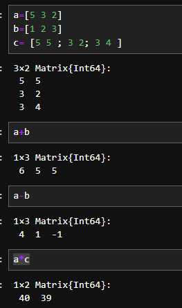{#fig:015 width=70%}

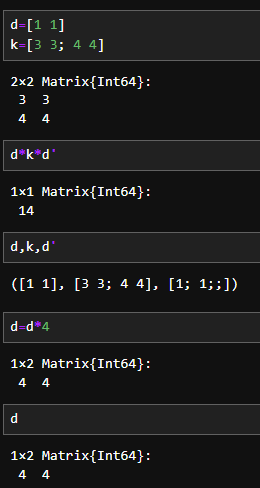{#fig:016 width=70%}

# Выводы

Подготовил рабочее пространство и иструментарий для работы с языком программирования Julia, на простейших примерах познакомился с основами синтаксиса Julia. Выполнил задания для самостоятельной работы.