---
## Front matter
title: "Компьютерный практикум по статистическому анализу данных лабораторная работа №4"
subtitle: "Линейная алгебра"
author: "Ким Илья Владиславович НФИбд-01-21"

## Generic otions
lang: ru-RU
toc-title: "Содержание"

## Bibliography
bibliography: bib/cite.bib
csl: pandoc/csl/gost-r-7-0-5-2008-numeric.csl

## Pdf output format
toc: true # Table of contents
toc-depth: 2
fontsize: 12pt
linestretch: 1.5
papersize: a4
documentclass: scrreprt
## I18n polyglossia
polyglossia-lang:
  name: russian
  options:
	- spelling=modern
	- babelshorthands=true
polyglossia-otherlangs:
  name: english
## I18n babel
babel-lang: russian
babel-otherlangs: english
## Fonts
mainfont: IBM Plex Serif
romanfont: IBM Plex Serif
sansfont: IBM Plex Sans
monofont: IBM Plex Mono
mathfont: STIX Two Math
mainfontoptions: Ligatures=Common,Ligatures=TeX,Scale=0.94
romanfontoptions: Ligatures=Common,Ligatures=TeX,Scale=0.94
sansfontoptions: Ligatures=Common,Ligatures=TeX,Scale=MatchLowercase,Scale=0.94
monofontoptions: Scale=MatchLowercase,Scale=0.94,FakeStretch=0.9
mathfontoptions:
## Biblatex
biblatex: true
biblio-style: "gost-numeric"
biblatexoptions:
  - parentracker=true
  - backend=biber
  - hyperref=auto
  - language=auto
  - autolang=other*
  - citestyle=gost-numeric
## Pandoc-crossref LaTeX customization
figureTitle: "Рис."
## Misc options
indent: true
header-includes:
  - \usepackage{indentfirst}
  - \usepackage{float} # keep figures where there are in the text
  - \floatplacement{figure}{H} # keep figures where there are in the text
---

# Цель работы

Основной целью работы является изучение возможностей специализированных пакетов Julia для выполнения и оценки эффективности операций над объектами линейной
алгебры.

# Задание

1. Используя Jupyter Lab, повторите примеры из раздела 4.2.

2. Выполните задания для самостоятельной работы (раздел 4.4).

# Выполнение работы. Повтор примеров из раздела 4.2

## 4.2.1. Поэлементные операции над многомерными массивами

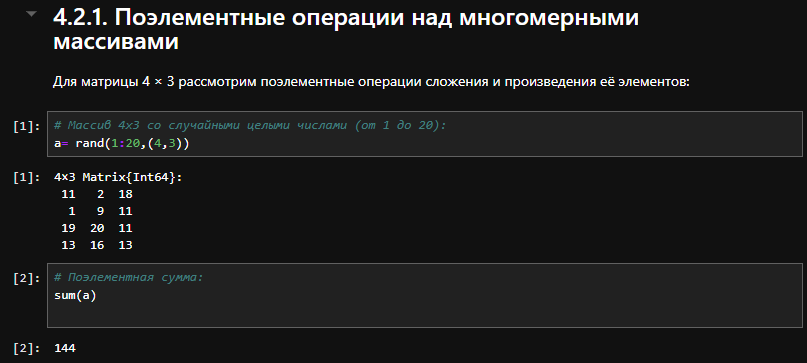{#fig:001 width=70%}

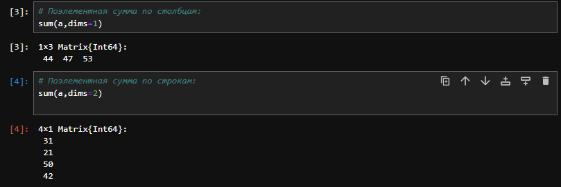{#fig:002 width=70%}

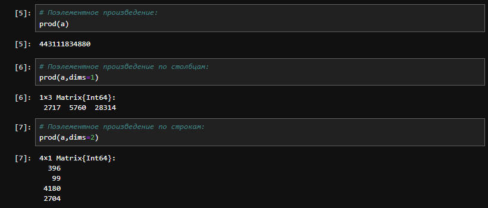{#fig:003 width=70%}

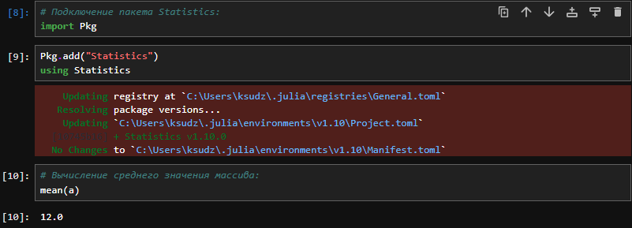{#fig:004 width=70%}

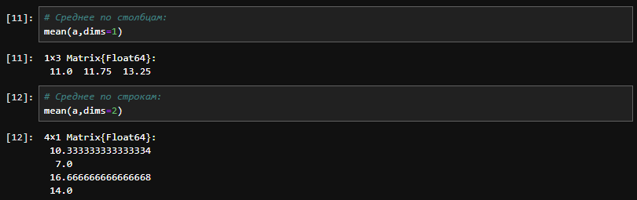{#fig:005 width=70%}

## 4.2.2. Транспонирование, след, ранг, определитель и инверсия матрицы

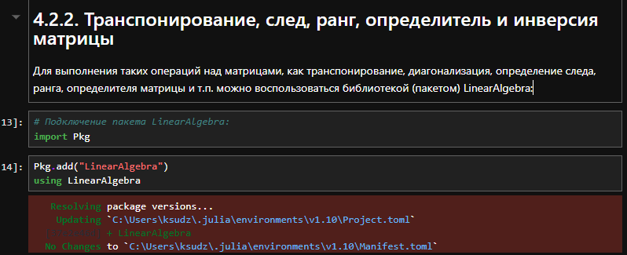{#fig:006 width=70%}

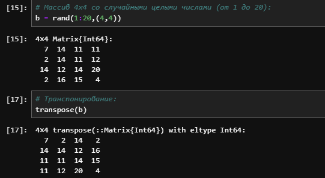{#fig:007 width=70%}

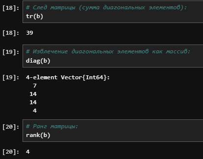{#fig:008 width=70%}

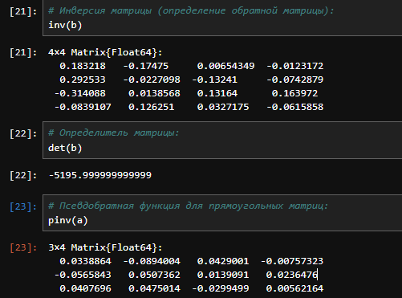{#fig:009 width=70%}

## 4.2.3. Вычисление нормы векторов и матриц, повороты, вращения

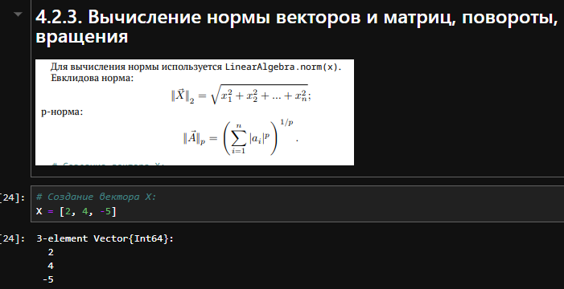{#fig:010 width=70%}

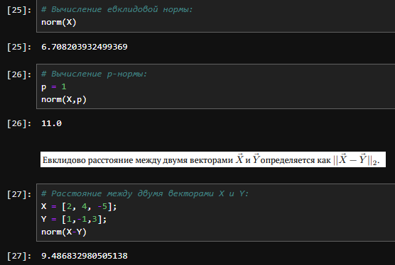{#fig:011 width=70%}

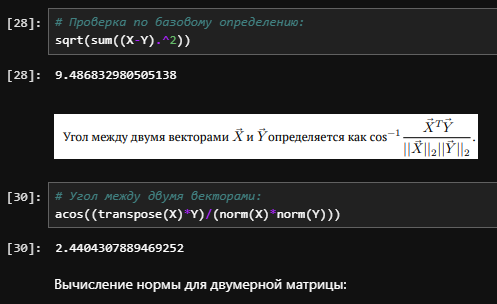{#fig:012 width=70%}

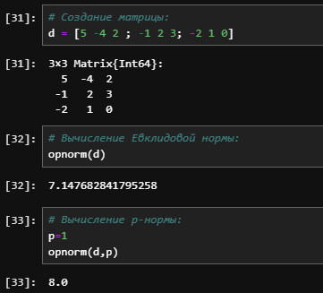{#fig:013 width=70%}

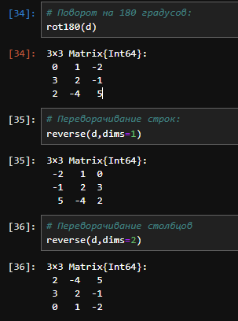{#fig:014 width=70%}

## 4.2.4. Матричное умножение, единичная матрица, скалярное произведение

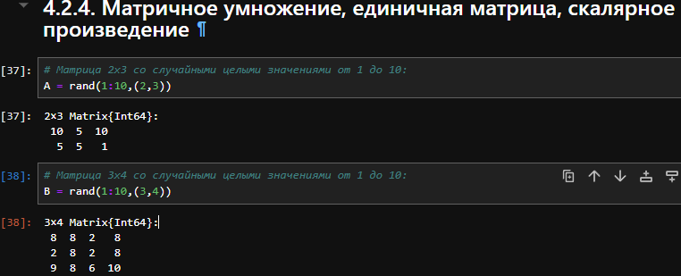{#fig:015 width=70%}

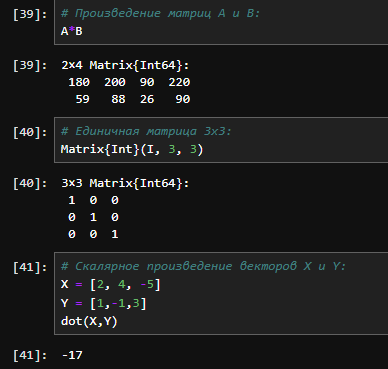{#fig:016 width=70%}

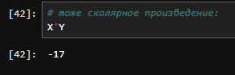{#fig:017 width=70%}

# 4.2.5. Факторизация. Специальные матричные структуры

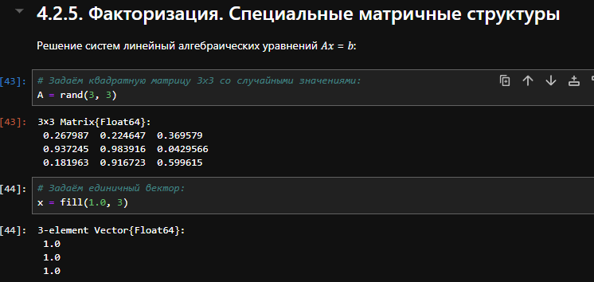{#fig:018 width=70%}

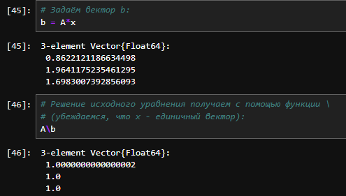{#fig:019 width=70%}

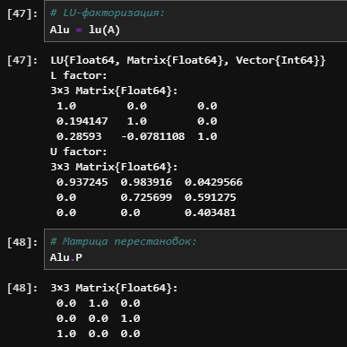{#fig:020 width=70%}

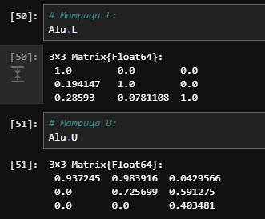{#fig:021 width=70%}

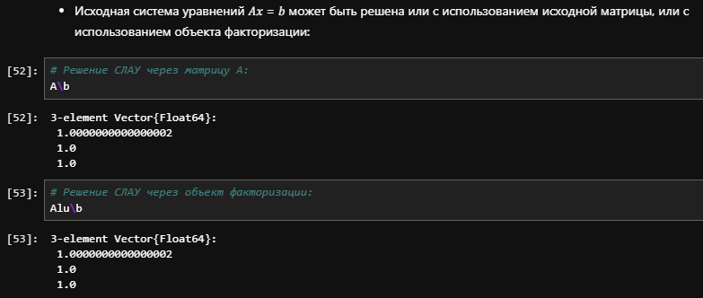{#fig:022 width=70%}

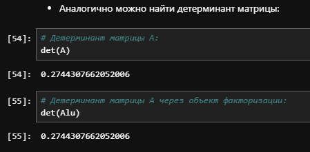{#fig:023 width=70%}

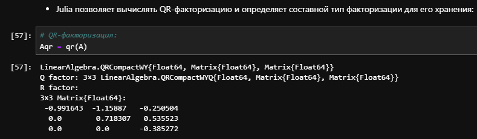{#fig:024 width=70%}

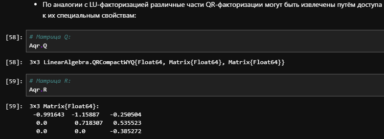{#fig:25 width=70%}

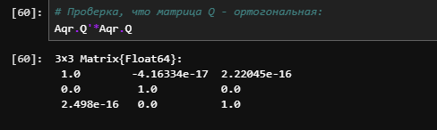{#fig:26 width=70%}

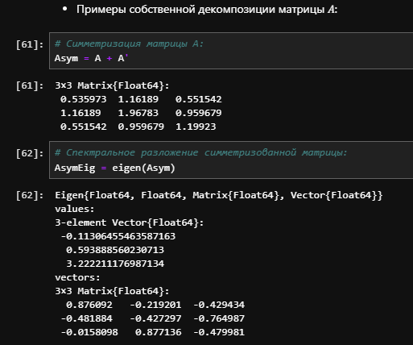{#fig:27 width=70%}

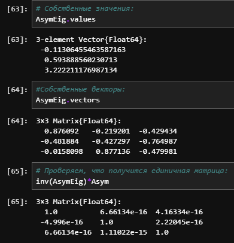{#fig:28 width=70%}

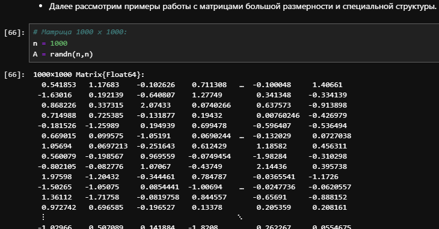{#fig:29 width=70%}

{#fig:30 width=70%}

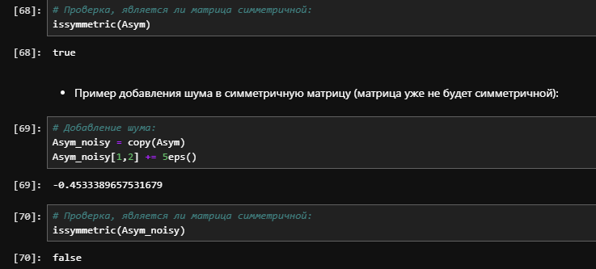{#fig:31 width=70%}

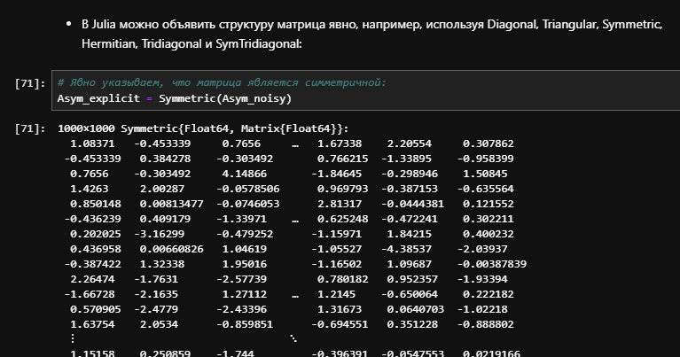{#fig:32 width=70%}

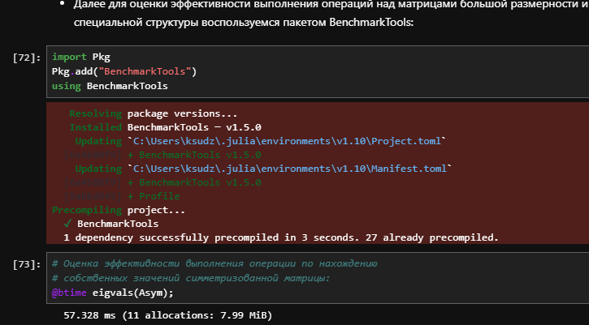{#fig:33 width=70%}

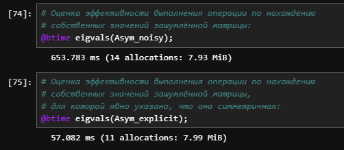{#fig:34 width=70%}

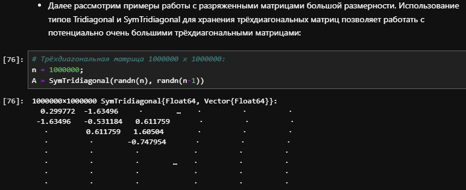{#fig:35 width=70%}

{#fig:36 width=70%}

# 4.2.6. Общая линейная алгебра

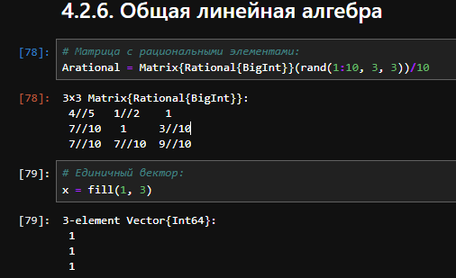{#fig:37 width=70%}

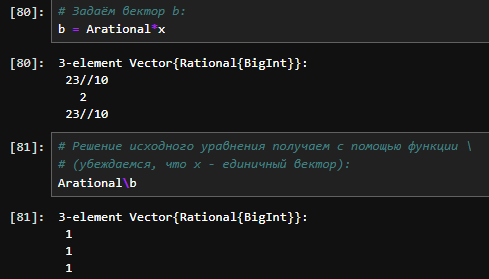{#fig:38 width=70%}

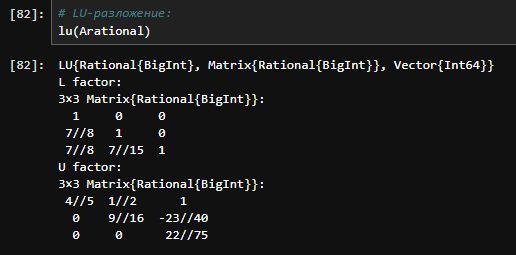{#fig:39 width=70%}

# 4.4 Задания для самостоятельного выполнения

## 4.4.1. Произведение векторов

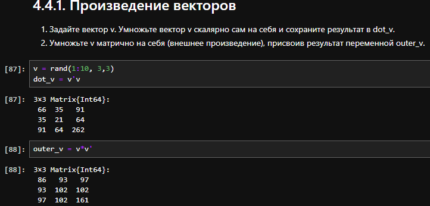{#fig:40 width=70%}

## 4.4.2. Системы линейных уравнений

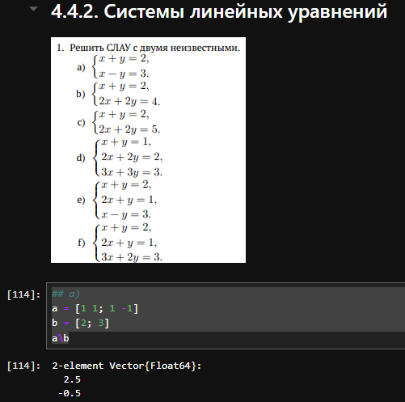{#fig:41 width=70%}

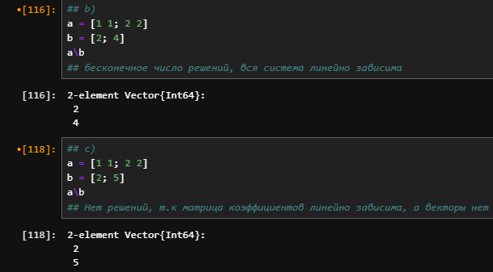{#fig:42 width=70%}

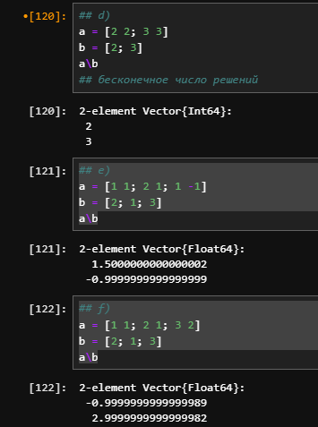{#fig:43 width=70%}

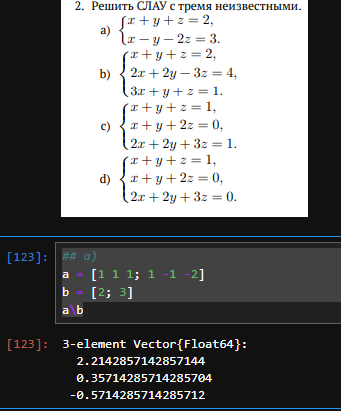{#fig:44 width=70%}

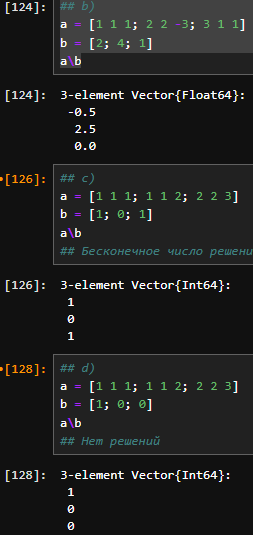{#fig:45 width=70%}

## 4.4.3. Операции с матрицами

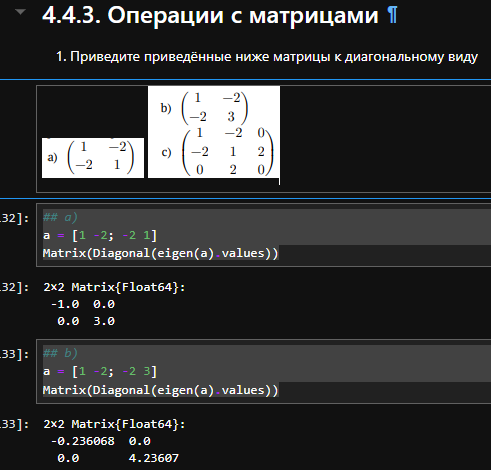{#fig:46 width=70%}

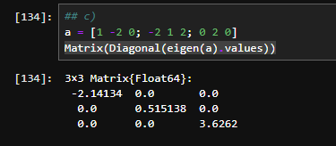{#fig:47 width=70%}

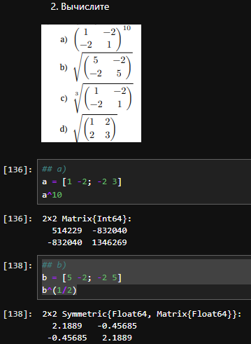{#fig:48 width=70%}

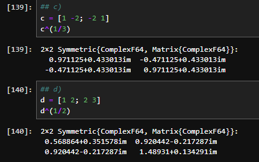{#fig:49 width=70%}

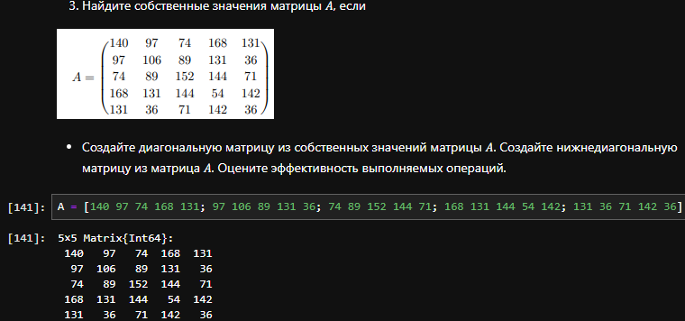{#fig:50 width=70%}

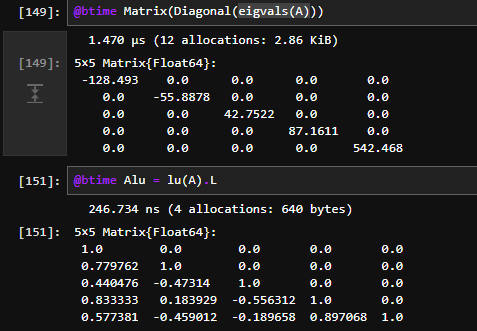{#fig:51 width=70%}

## 4.4.4. Линейные модели экономики

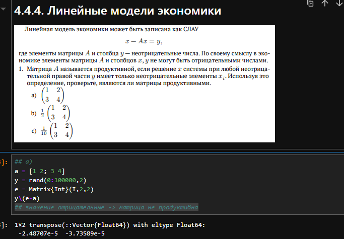{#fig:52 width=70%}

{#fig:53 width=70%}

{#fig:54 width=70%}

{#fig:55 width=70%}

{#fig:56 width=70%}

{#fig:57 width=70%}

# Выводы

Использую Jupyter lab повторил примеры из раздела 4.2 и выполнил задания для самостоятельной работы. Изучил возможности специальных пакетов Julia для выполнения и оценки эффективности операций над объектами линейной алгебры.